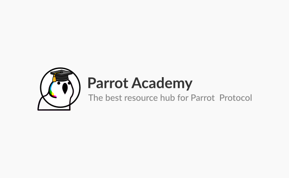

<p align="center">
  <a href="#">
    
  </a>
</p>


## How to Contribute

1.  **Setup**

    Go to root path and install packages
    ```shell
    npm install
    ```
    Start a local server
    ```
    gatsby develop -H 0.0.0.0
    ````

2.  **Add Content**

    Navigate into your new site’s directory and start it up.

    You can contribute to 3 categories of content. You can find the corresponding folders in the root directory.

    For Example to add a 'Getting Started' content.

    * Create a folder in the Getting Started directory with the slug of your post as the name.

    > eg. `Getting Started with Pai article` will have a folder name called `getting-started-with-pai`

    * Add an `index.mdx` file to the new folder and add your content to it. The content of the mdx should preceed with the following frontmatter requirements.
    ```md
    ---
    title: Article or Content Name
    date: "YYYY-MM-DD"
    category: "strategies" or "how-to" or getting-started"
    featured: true
    hero_image: "relative/path/to/image" or null 
    hero_image_alt: "image alt text"
    ---
    ```

    Content supports the markdown formating style. 
    
    It also supports Youtube Embed. To embed a youtube video in your mdx file.
    For example use at the position you want the video to show.
    ```mdx
    <Youtube youtubeId="K4TOrB7at0Y">
    ```
    You can find other options [here](https://www.mdx-embed.com/?path=/docs/components-youtube--usage)

    > You can also add image files to your article folder and reference them using their relative paths.


## Visit us on [Discord](https://discord.gg/gopartyparrot) for more information. 
