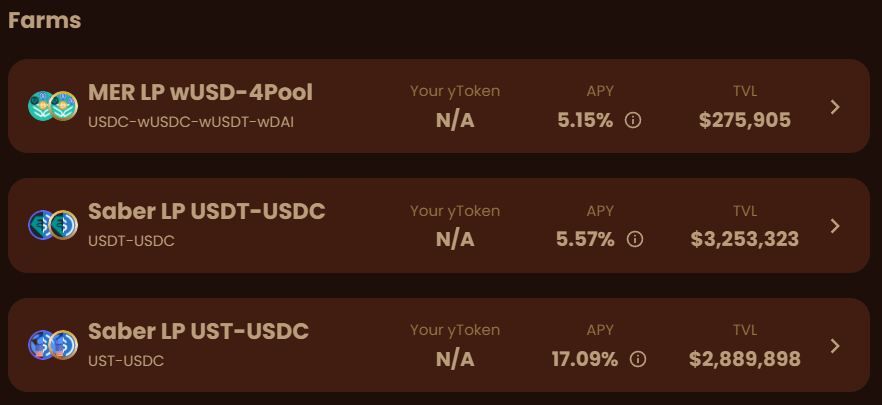

In this article, we will be exploring how users can make the most of their LP tokens by utilizing BunnyDucky and Parrot.
Let’s look at what a strategy using BunnyDucky will generally look like.

### Step 1: Deposit into a pool supported by BunnyDucky

  BunnyDucky currently supports a few Mercurial and Saber pools.

 
  The Saber LP UST-USDC pool has the highest APY, so let’s go with that one. We go to Saber’s app, find the UST-USDC pool 
  under the Pools tab, deposit our UST and USDC, and receive LP tokens.

### Step 2: Deposit your LP tokens into BunnyDucky

In exchange, BunnyDucky will give you yield tokens (yTokens), which increase in value through compounding.

### Step 3: Deposit your yTokens into Parrot and borrow PAI

On Parrot, you can borrow PAI against your yTokens, enabling you to leverage your position.

### Step 4: Trade PAI for the LP assets

Since we deposited in Saber’s USDC-UST pool, we want to trade PAI for USDC and UST. We recommend using
Jupiter to get the best price for your trades.

This brings us back to step 1, where the cycle begins again. Normally, you would end your leveraging process by performing steps 1 and 2 one last time so that your stablecoins are earning yield, 
but not going to step 3 to borrow more PAI.

In the next article, we will start to look at how to calculate and optimize our yield by performing the above cycle multiple times!